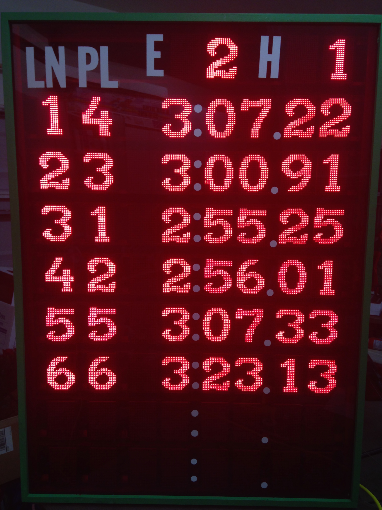

#OpenScoreboard
## An Open Source Wireless Swimming Scoreboard that can be easily modified for other sports

OpenScoreboard is an Eagle Scout Project completed by David Cox in 2014.  The beneficiary/sponsoring organization was the Gleannloch Gators Swim Team.

The scoreboard hardware is designed around an Arduino derivative known as the Moteino from Felix Rusu at lowpowerlabs.com.  A program on a host PC implements a filewatcher.  When a new set of times is written to the hard drive of the host PC at the end of a completed heat, the program parses the times, calculates the swimmers tentative official time, determines the order of finish, and passes the data to a USB attached Moteino.  This Moteino then passes the information wirelessly to the scoreboard where it is displayed.  The results of a given heat are displayed until the next heat completes.  While this is a bit different than typical swimming scoreboards (which reset as soon as the next heat starts), it allows the coaches and swimmers to focus on the logistics of finishing one heat and beginning the next heat without having to hurriedly view the scoreboard.

License Info:

 OpenScoreboard by <a xmlns:cc="http://creativecommons.org/ns#" href="https://github.com/btodcox/Scoreboard" property="cc:attributionName" rel="cc:attributionURL">B Tod Cox & David Cox</a> is licensed under a <a rel="license" href="http://creativecommons.org/licenses/by-sa/4.0/">Creative Commons Attribution-ShareAlike 4.0 International License</a>. A copy of the license is available at the provided link. 

Portions of this project leverages other projects; attributions are included in the repository.

## Bill of Materials for 8-Lane Wireless Scoreboard

The estimated total cost for an 8-lane OpenScoreboard is ~$2500.

Custom PCA (a total of N+1 Custom PCAs are needed for an N-lane scoreboard)

*   9x Custom Scoreboard PCB (Eagle CAD files included in repository)
*   18X 74AHCT245D Octal Transceiver SOIC-20 ([Mouser 771-AHCT245D118](http://www.mouser.com/Search/ProductDetail.aspx?R=74AHCT245D,118virtualkey66800000virtualkey771-AHCT245D118))
*   2.1mm x 5.5mm DC barrel jack ([Mouser 163-7620E-E](http://www.mouser.com/Search/ProductDetail.aspx?R=163-7620E-Evirtualkey11180000virtualkey163-7620E-E))
*   18X dual row 2x5 0.1" female header ([Mouser 571-215309-5](http://www.mouser.com/Search/ProductDetail.aspx?R=215309-5virtualkey57100000virtualkey571-215309-5))
*   ~250X Breakaway 0.1" Male Headers ([Mouser 649-54101-S08-00](http://www.mouser.com/Search/ProductDetail.aspx?R=54101-S08-00virtualkey64910000virtualkey649-54101-S08-00))
*   18X 0.1uF 16V 10% X7R 0603 capacitor ([Mouser 80-C0603C104K4R7411](http://www.mouser.com/Search/ProductDetail.aspx?R=C0603C104K4RAC7411virtualkey64600000virtualkey80-C0603C104K4R7411))

Electronic Parts

*   9X [Moteino Arduino clone with tranceiver and flash](http://lowpowerlab.com/moteino/#pinout)
*   1X [USB Moteino with transciever and no flash](http://lowpowerlab.com/moteino/#pinout)
*   68X 16x24 Red LED Matrix Panel Chainable HT1632C Driver ([Adafruit part #555](http://www.adafruit.com/products/555))
*   408X 1206 4RNet 27 Ohm 5% (to increase brightness of LED panels) ([Mouser 667-EXB-38V270JV](http://www.mouser.com/Search/ProductDetail.aspx?R=EXB-38V270JVvirtualkey66720000virtualkey667-EXB-38V270JV))
*   84X 2x5 IDC ribbon cable male connectors (need a different part number as I don't like the ones that I last ordered from Mouser)
*   ~50ft Flat Cables 28 AWG Ribbon .050 Zip 10 Cond ([Mouser 523-191-2801-110FT](http://www.mouser.com/Search/ProductDetail.aspx?R=191-2801-110FTvirtualkey52320000virtualkey523-191-2801-110FT))
*   4X 5V 10A switching power supply ([Adafruit part #658](http://www.adafruit.com/product/658))
*   3X 2-Way 2.1mm DC Barrel Jack Splitter Squid ([Adafruit part #1351](http://www.adafruit.com/product/1351))
*   Heavy gauge wire for connecting three lanes together (could not find a squid splitter long enough for Event/Heat + 2 lanes)
*   Surge protector
*   Mini-USB to USB cable
*   Small plastic box for USB Moteino

Case/Mechanical Structure

*   18X 3/4 in. x 1/2 in. x 36 in. Aluminum Flat Angle with 1/16 in. Thick ([Home Depot](http://www.homedepot.com/p/Crown-Bolt-3-4-in-x-1-2-in-x-36-in-Aluminum-Flat-Angle-with-1-16-in-Thick-43650/202183475)/Lowes/etc)
*   2X Steelworks 6-ft L x -3/4-in W x -3/4-in H Aluminum Plain Square Tube ([Lowes](http://www.lowes.com/pd_215691-37672-11388_0__)/Home Depot/etc)
*   Red Cast Acrylic (Aero-Shield Plastics in Houston)
*   1x6 Poplar S4S boards for case (Home Depot/Lowes/etc)
*   272X 4-40 x 1" female/female hex binding post ([Mouser 534-2205](http://www.mouser.com/Search/ProductDetail.aspx?R=2205virtualkey53400000virtualkey534-2205))
*   544x 4-40 3/8" phillips head screws ([Mouser 534-9901](http://www.mouser.com/Search/ProductDetail.aspx?R=9901virtualkey53400000virtualkey534-9901))
*   1-1/4 in. Coarse Zinc-Plated Steel Square-Head Pocket Screws (100-Pack) ([Home Depot](http://www.homedepot.com/p/Kreg-1-1-4-in-Coarse-Zinc-Plated-Steel-Square-Head-Pocket-Screws-100-Pack-SML-C125-100/100572559))
*   1X 1/4 in. 5 ft. x 5ft Baltic Birch Plywood-Grade A ([Houston Hardwoods](http://www.houstonhardwoods.net/))
*   Paint for wood (less than 1/2 pint is needed to cover wood)
*   Exterior grade urethane for back of plywood
*   Black matte spray paint for interior of plywood and aluminum